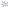

# smiles2svg

Script to make vector images of 2D-molecules from their SMILES code.

## Requirements
```
numpy==1.24.3
rdkit==2023.3.2
svgwrite==1.4.3
```

## Basic usage

```
smiles2svg -s 'Cn1cnc2n(C)c(=O)n(C)c(=O)c12' 
```

Creates a SVG image with the default parameters and produces the following image


A plain text file with all the SMILES codes written as individual lines can also be used as input.
In this case the script with generate a SVG files for each individual SMILES code in the file.

```
smiles2svg -f 'smiles.txt'
```
An example file can be found in the `example` forlder with several SMILES codes.

## Drawing options

Run
```
smiles2svg.py -h
```
to see help:
```
-h, --help            show this help message and exit
-s SMILES, --smiles SMILES
                      SMILES string of the mol
-f SMILES_FILE, --smiles_file SMILES_FILE
                      Name of the file with all the SMILES
                      codes
-n NAME, --name NAME  Name for the SVG image
--style {plain,names_hetero,names_all}
                      Select the style for the atoms.
                      (default='plain')
--color COLOR         Select a color for all the molecule.
                      If 'default', colors will the have
                      different colors depending on the
                      element. (default='default')

```

## Examples

```
python smiles2svg.py -s 'Cn1cnc2n(C)c(=O)n(C)c(=O)c12' --style 'names_hetero'
```

```
python smiles2svg.py -s 'Cn1cnc2n(C)c(=O)n(C)c(=O)c12' --style 'names_hetero' --color '#468BFF'
```

```
python smiles2svg.py -s 'Cn1cnc2n(C)c(=O)n(C)c(=O)c12' --style 'names_all'
```


## Future features
- Change font
- Add stroke to all atoms
- Addition of Hydrogens in HB-donors
- Addition of LP orbitals
