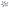

# smiles2svg

Script to make vector images of 2D-molecules from their SMILES code.

## Requirements
```
CairoSVG==2.7.1
numpy==1.24.3
rdkit==2023.3.2
svgwrite==1.4.3
```

## Basic usage

```
smiles2svg -s 'Cn1cnc2n(C)c(=O)n(C)c(=O)c12' 
```

Creates a SVG image with the default parameters and produces the following image


A plain text file with all the SMILES codes written as individual lines can also be used as input.
In this case the script with generate a SVG files for each individual SMILES code in the file.

```
smiles2svg -f 'smiles.txt'
```
An example file can be found in the `example` forlder with several SMILES codes.

## Drawing options

Run
```
smiles2svg.py -h
```
to see help:
```
  -h, --help            show this help message and exit
  -s SMILES, --smiles SMILES
                        SMILES string of the mol (default: none)
  -f SMILES_FILE, --smiles_file SMILES_FILE
                        Name of the file with all the SMILES codes (default: none)
  -n NAME, --name NAME  Name for the SVG (and PNG) image. Only available for 1 SMILES code, not for list of SMILES.
                        (default: SMILES)
  --style {plain,names_hetero,names_all,stroke}
                        Select the style for the atoms. (default: plain)
  --color COLOR         Select a color for all the molecule. If 'default', atoms will have different colors depending on
                        the element. (default: default)
  --png                 Saves the figure in png format as well. (default: False)
  --png_width PNG_WIDTH
                        Select the image width in pixels. (default: 900)
  --font FONT           Select the font for the atomic symbols. (default: Calibri)
  --bond_color BOND_COLOR
                        Select the color for the bonds format "#RRGGBB". (default: #717171)
  --add_hydrogens       Adds Hydrogen atoms to the HB-Donors. (default: False)
```

## Examples

```
smiles2svg.py -s 'Cn1cnc2n(C)c(=O)n(C)c(=O)c12' --style 'stroke'
```

```
smiles2svg.py -s 'Cn1cnc2n(C)c(=O)n(C)c(=O)c12' --style 'names_hetero'
```

```
smiles2svg.py -s 'Cn1cnc2n(C)c(=O)n(C)c(=O)c12' --style 'names_hetero' --color '#468BFF'
```

```
smiles2svg.py -s 'Cn1cnc2n(C)c(=O)n(C)c(=O)c12' --style 'names_all'
```

```
smiles2svg.py -s 'Cn1cnc2n(C)c(=O)n(C)c(=O)c12' --add_hydrogens
```


## Future features
- [x] Select font
- [ ] Center text properly
- [x] Save as PNG
- [x] Add option to custom name
- [x] Add option to draw stroke to all atoms
- [ ] Add option to draw the bonds with a color gradient between the atoms
- [x] Addition of Hydrogens in HB-donors
- [ ] Addition of LP orbitals
